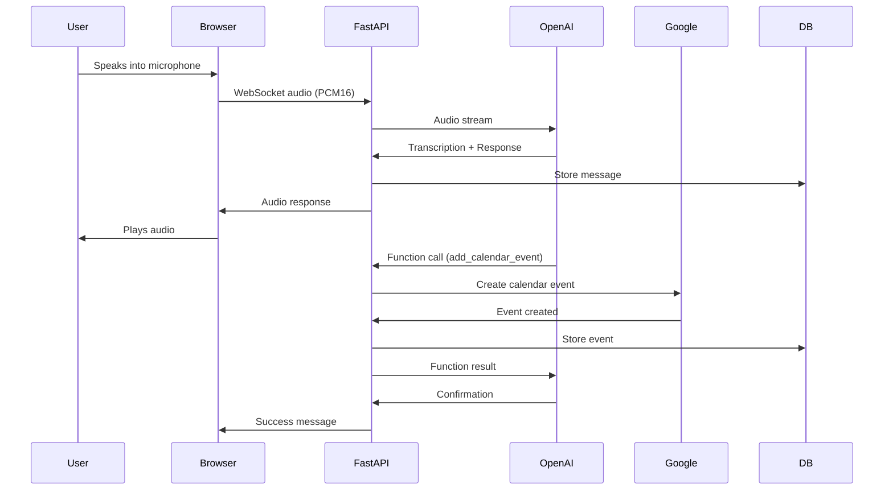

# Voice Scheduling Agent

A production-ready real-time voice assistant that helps users schedule calendar meetings through natural voice conversations. Built with FastAPI, OpenAI Realtime API, and Google Calendar integration.


## 🎯 Features

- 🎤 **Real-time Voice Interaction** - Powered by OpenAI Realtime API for natural conversations
- 📅 **Google Calendar Integration** - Automatically creates calendar events from voice conversations
- 💾 **Conversation History** - SQLite database stores all conversations, messages, and events
- 📊 **REST API** - Comprehensive API for accessing conversation history and statistics
- 🔒 **Secure OAuth** - Google OAuth 2.0 authentication with token management
- 📝 **Structured Logging** - JSON-formatted logs with rotation and error tracking
- 🐳 **Docker Support** - Containerized deployment with Docker and docker-compose
- ☁️ **AWS EC2 Ready** - Complete deployment configuration for EC2 instances
- 📚 **API Documentation** - Interactive Swagger/OpenAPI documentation

## 📋 Table of Contents

- [Architecture](#architecture)
- [Prerequisites](#prerequisites)
- [Installation](#installation)
- [Configuration](#configuration)
- [Running the Application](#running-the-application)
- [API Documentation](#api-documentation)
- [Deployment](#deployment)
- [Development](#development)
- [Troubleshooting](#troubleshooting)

## 🏗️ Architecture

### System Overview

```
┌─────────────┐
│   Browser   │
│  (Frontend) │
└──────┬──────┘
       │ WebSocket/HTTP
       │
┌──────▼──────────────────────────────────────┐
│         FastAPI Backend                     │
│  ┌──────────────────────────────────────┐  │
│  │  WebSocket Router                     │  │
│  │  - Audio relay                        │  │
│  │  - Session management                 │  │
│  └──────────────┬────────────────────────┘  │
│                 │                            │
│  ┌──────────────▼──────────────┐            │
│  │  Services Layer             │            │
│  │  - Calendar Service          │            │
│  │  - Conversation Service     │            │
│  │  - OpenAI Realtime Client   │            │
│  └──────────────┬──────────────┘            │
│                 │                            │
│  ┌──────────────▼──────────────┐            │
│  │  Database Layer             │            │
│  │  - SQLAlchemy ORM           │            │
│  │  - SQLite Database           │            │
│  └─────────────────────────────┘            │
└──────┬──────────────────────────────────────┘
       │
       ├──────────────┬──────────────┐
       │              │              │
┌──────▼──────┐ ┌────▼─────┐ ┌──────▼──────┐
│   OpenAI    │ │  Google  │ │   SQLite    │
│  Realtime   │ │ Calendar │ │  Database   │
│    API      │ │   API    │ │             │
└─────────────┘ └──────────┘ └─────────────┘
```

### Component Architecture

#### Frontend (`static/`)
- **HTML/CSS/JavaScript** - Modern web UI with voice orb visualization
- **Web Audio API** - Captures microphone audio at 24kHz PCM16 format
- **WebSocket Client** - Real-time bidirectional communication

#### Backend (`app/`)

**Routers** (`app/routers/`)
- `auth.py` - Google OAuth 2.0 authentication flow
- `websocket.py` - WebSocket relay between browser and OpenAI
- `api.py` - REST API endpoints for data access

**Services** (`app/services/`)
- `calendar.py` - Google Calendar API operations and OAuth token management
- `conversation.py` - Database operations for conversations and messages
- `openai_realtime.py` - OpenAI Realtime API configuration and helpers

**Models** (`app/models.py`)
- `User` - User accounts and OAuth tokens
- `Conversation` - Conversation sessions
- `Message` - Individual messages in conversations
- `CalendarEvent` - Created calendar events

**Utilities** (`app/utils/`)
- `logger.py` - Structured JSON logging with rotation
- `config.py` - Pydantic settings management

### Data Flow



## 📦 Prerequisites

- **Python 3.11+** (3.11 or higher)
- **OpenAI API Key** - Get from [OpenAI Platform](https://platform.openai.com/api-keys)
- **Google Cloud Project** with:
  - Google Calendar API enabled
  - OAuth 2.0 credentials created
  - Authorized redirect URI configured

### Google Cloud Setup

1. Go to [Google Cloud Console](https://console.cloud.google.com/)
2. Create a new project or select existing
3. Enable **Google Calendar API**
4. Go to **APIs & Services > Credentials**
5. Create **OAuth 2.0 Client ID** (Web application)
6. Add authorized redirect URI: `http://localhost:8000/auth/callback` (or your domain)
7. Download credentials or copy Client ID and Secret

## 🚀 Installation

### 1. Clone or Download

```bash
cd /path/to/schedulingVoiceAgent
```

### 2. Create Virtual Environment

**Windows:**
```bash
python -m venv venv
venv\Scripts\activate
```

**Linux/Mac:**
```bash
python3 -m venv venv
source venv/bin/activate
```

### 3. Install Dependencies

```bash
pip install --upgrade pip
pip install -r requirements.txt
```

### 4. Create Environment File

```bash
# Copy the example file
cp env.example .env

# Edit .env and add your credentials
nano .env  # or use your preferred editor
```

### 5. Configure Environment Variables

Edit `.env` file with your credentials:

```env
# OpenAI
OPENAI_API_KEY=sk-your-openai-api-key-here

# Google OAuth
GOOGLE_CLIENT_ID=your-client-id.apps.googleusercontent.com
GOOGLE_CLIENT_SECRET=your-client-secret
GOOGLE_REDIRECT_URI=http://localhost:8000/auth/callback

# Optional: Customize other settings
DEBUG=true
LOG_LEVEL=INFO
```

## ⚙️ Configuration

### Environment Variables

| Variable | Description | Default | Required |
|----------|-------------|---------|----------|
| `OPENAI_API_KEY` | OpenAI API key | - | ✅ Yes |
| `GOOGLE_CLIENT_ID` | Google OAuth client ID | - | ✅ Yes |
| `GOOGLE_CLIENT_SECRET` | Google OAuth client secret | - | ✅ Yes |
| `GOOGLE_REDIRECT_URI` | OAuth redirect URI | `http://localhost:8000/auth/callback` | ✅ Yes |
| `HOST` | Server host | `0.0.0.0` | No |
| `PORT` | Server port | `8000` | No |
| `DEBUG` | Debug mode | `false` | No |
| `LOG_LEVEL` | Logging level | `INFO` | No |
| `DATABASE_URL` | Database connection string | `sqlite:///./data/voice_agent.db` | No |
| `CORS_ORIGINS` | Allowed CORS origins | `*` | No |

### Database

The application uses SQLite by default. The database file is created automatically at `data/voice_agent.db`.

**Schema:**
- `users` - User accounts and OAuth tokens
- `conversations` - Conversation sessions
- `messages` - Individual messages
- `calendar_events` - Created calendar events

## 🏃 Running the Application

### Development Mode

```bash
# Activate virtual environment
source venv/bin/activate  # Linux/Mac
# or
venv\Scripts\activate  # Windows

# Run the application
python run.py
```

The application will start on `http://localhost:8000`

### Using Uvicorn Directly

```bash
uvicorn app.main:app --reload --host 0.0.0.0 --port 8000
```

### Using Docker

```bash
# Build the image
docker build -t voice-scheduling-agent .

# Run the container
docker run -p 8000:8000 \
  -e OPENAI_API_KEY=your-key \
  -e GOOGLE_CLIENT_ID=your-id \
  -e GOOGLE_CLIENT_SECRET=your-secret \
  -v $(pwd)/data:/app/data \
  -v $(pwd)/logs:/app/logs \
  voice-scheduling-agent
```

### Using Docker Compose

```bash
# Create .env file first
cp env.example .env
# Edit .env with your credentials

# Start services
docker-compose up -d

# View logs
docker-compose logs -f
```

## 📚 API Documentation

### Interactive Documentation

Once the application is running, access the interactive API documentation:

- **Swagger UI**: http://localhost:8000/docs
- **ReDoc**: http://localhost:8000/redoc
- **OpenAPI JSON**: http://localhost:8000/openapi.json

### API Endpoints

#### Authentication

| Endpoint | Method | Description |
|----------|--------|-------------|
| `/auth/login` | GET | Initiate Google OAuth flow |
| `/auth/callback` | GET | OAuth callback handler |
| `/auth/status` | GET | Check authentication status |
| `/auth/logout` | GET | Revoke authentication |

#### WebSocket

| Endpoint | Description |
|----------|-------------|
| `/ws` | WebSocket endpoint for real-time voice communication |

#### REST API

| Endpoint | Method | Description |
|----------|--------|-------------|
| `/api/health` | GET | Health check endpoint |
| `/api/stats` | GET | Get application statistics |
| `/api/conversations` | GET | List all conversations |
| `/api/conversations/{id}` | GET | Get conversation details |
| `/api/conversations/{id}/messages` | GET | Get conversation messages |
| `/api/events` | GET | List created calendar events |

### Example API Calls

**Health Check:**
```bash
curl http://localhost:8000/api/health
```

**Get Statistics:**
```bash
curl http://localhost:8000/api/stats
```

**List Conversations:**
```bash
curl http://localhost:8000/api/conversations?limit=10&offset=0
```

## 🚢 Deployment

### AWS EC2 Deployment

#### 1. Launch EC2 Instance

- **Instance Type**: t3.small or larger
- **OS**: Ubuntu 22.04 LTS
- **Security Group**: Open ports 22 (SSH), 80 (HTTP), 443 (HTTPS)

#### 2. Setup Server

```bash
# SSH into your EC2 instance
ssh -i your-key.pem ubuntu@your-ec2-ip

# Upload your code (or clone from git)
# Then run the setup script
chmod +x deploy/setup.sh
./deploy/setup.sh
```

#### 3. Configure Environment

```bash
cd /home/ubuntu/voice-scheduling-agent
cp env.example .env
nano .env  # Add your credentials
```

**Important**: Update `GOOGLE_REDIRECT_URI` to your domain:
```env
GOOGLE_REDIRECT_URI=https://yourdomain.com/auth/callback
```

#### 4. Update Google Cloud Console

1. Go to Google Cloud Console > Credentials
2. Edit your OAuth 2.0 Client ID
3. Add authorized redirect URI: `https://yourdomain.com/auth/callback`

#### 5. Start Service

```bash
sudo systemctl start voice-agent
sudo systemctl status voice-agent
```

#### 6. Setup SSL (HTTPS)

```bash
# Install Certbot if not already installed
sudo apt-get install certbot python3-certbot-nginx

# Get SSL certificate
sudo certbot --nginx -d yourdomain.com

# Certbot will automatically configure Nginx
```

#### 7. Verify Deployment

- Check service: `sudo systemctl status voice-agent`
- Check logs: `tail -f logs/app.log`
- Test health: `curl http://localhost:8000/api/health`

### Docker Production Deployment

```bash
# Build production image
docker build -t voice-scheduling-agent:latest .

# Run with production settings
docker run -d \
  --name voice-agent \
  --restart unless-stopped \
  -p 8000:8000 \
  --env-file .env \
  -v $(pwd)/data:/app/data \
  -v $(pwd)/logs:/app/logs \
  voice-scheduling-agent:latest
```

## 🛠️ Development

### Project Structure

```
schedulingVoiceAgent/
├── app/                      # Application package
│   ├── __init__.py
│   ├── config.py            # Configuration management
│   ├── database.py          # Database setup
│   ├── main.py              # FastAPI app factory
│   ├── models.py            # SQLAlchemy models
│   ├── routers/             # API routers
│   │   ├── api.py           # REST API endpoints
│   │   ├── auth.py          # Authentication
│   │   └── websocket.py     # WebSocket handler
│   ├── services/            # Business logic
│   │   ├── calendar.py      # Google Calendar
│   │   ├── conversation.py # Conversation storage
│   │   └── openai_realtime.py
│   └── utils/               # Utilities
│       └── logger.py        # Logging
├── static/                  # Frontend files
│   ├── index.html
│   ├── style.css
│   └── app.js
├── data/                    # Database files
├── logs/                    # Log files
├── deploy/                  # Deployment configs
│   ├── nginx.conf
│   ├── setup.sh
│   └── voice-agent.service
├── .env                     # Environment variables (not in git)
├── requirements.txt         # Python dependencies
├── Dockerfile               # Docker image
├── docker-compose.yml       # Docker compose
└── run.py                   # Entry point
```

### Running Tests

```bash
# Install test dependencies
pip install pytest pytest-asyncio httpx

# Run tests (when tests are added)
pytest
```

### Code Style

```bash
# Install formatting tools
pip install black isort flake8

# Format code
black app/
isort app/

# Lint code
flake8 app/
```

## 🐛 Troubleshooting

### Common Issues

#### 1. OpenAI API Key Error

**Error**: `Invalid OpenAI API key`

**Solution**: 
- Verify your API key in `.env`
- Check that the key has access to Realtime API
- Ensure no extra spaces in the key

#### 2. Google OAuth Error

**Error**: `Scope has changed` or `redirect_uri_mismatch`

**Solution**:
- Ensure redirect URI in `.env` matches Google Cloud Console
- Check that OAuth consent screen is configured
- Verify client ID and secret are correct

#### 3. Database Errors

**Error**: `Database locked` or permission errors

**Solution**:
- Ensure `data/` directory exists and is writable
- Check file permissions: `chmod 755 data/`
- Stop other instances that might be using the database

#### 4. WebSocket Connection Issues

**Error**: WebSocket connection fails

**Solution**:
- Check firewall settings (port 8000)
- Verify Nginx configuration if using reverse proxy
- Check browser console for errors
- Ensure microphone permissions are granted

#### 5. Audio Not Working

**Error**: No audio input/output

**Solution**:
- Grant microphone permissions in browser
- Check browser console for errors
- Verify Web Audio API is supported
- Test with Chrome or Edge (best compatibility)

### Logs

View application logs:

```bash
# Application logs
tail -f logs/app.log

# Error logs
tail -f logs/app.error.log

# Systemd service logs
sudo journalctl -u voice-agent -f
```

### Debug Mode

Enable debug mode for detailed logging:

```env
DEBUG=true
LOG_LEVEL=DEBUG
```

## 📝 License

This project is licensed under the MIT License - see the LICENSE file for details.

## 🤝 Contributing

Contributions are welcome! Please feel free to submit a Pull Request.

## 📧 Support

For issues and questions:
- Open an issue on GitHub
- Check the documentation at `/docs`
- Review logs in `logs/` directory

## 🙏 Acknowledgments

- [FastAPI](https://fastapi.tiangolo.com/) - Modern web framework
- [OpenAI](https://openai.com/) - Realtime API
- [Google Calendar API](https://developers.google.com/calendar) - Calendar integration
- [SQLAlchemy](https://www.sqlalchemy.org/) - ORM

---

**Made with ❤️ for voice-powered scheduling**
